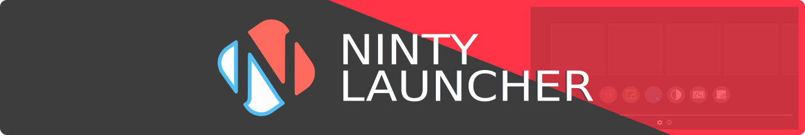
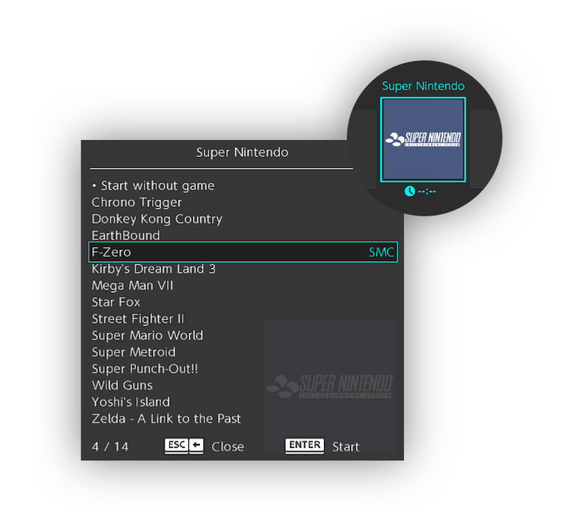
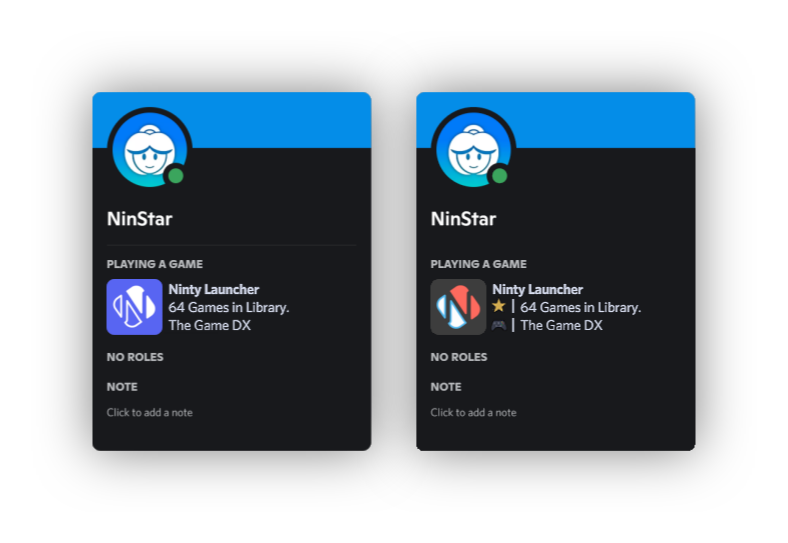

[][home]

# Overview

A launcher based on the Nintendo Switch designed to organize your emulators, fangames and modding tools. It can also be used with a wide variety of softwares.


## Features

- An ever-growing [collection of icons][database] for emulators, fangames and modding tools.
- Support for custom themes with animated wallpapers and songs.
- Dedicated menu for launching applications and games with specific files.
- Personalized Discord activity status for games that does not have one.



<p align="center"><a href="https://ninstars.itch.io/ninty"></a></p>

- Discover new themes and icons in our [Discord][discord]
- Learn how to make your own themes: [Guide][guide]

# Compile

1. Clone the repository:
```bash
git clone https://github.com/ninstar/Ninty-Launcher.git
```
2. Download [GameMaker][gamemaker].
3. Open the project file.
4. Go to **File ➜ Create Executable**.

# Credits

- **Art, Code & Design** - NinStar
- **Logo** - Biel98765
- **Translations**
	- **English** - Biel98765, Lake
	- **French** - Majora03
	- **Italian** - MasterXYZ
	- **Spanish** - GlitchyPSI
	- **Polish** - VECTORNICKER
	- **Portuguese** - NinStar
	- **Russian** - MaxNox
- **Sample Themes** - NinStar

[home]: https://ninstars.blogspot.com/p/ninty.html
[guide]: https://github.com/ninstar/Ninty-Launcher/wiki
[database]: https://github.com/ninstar/Ninty-Launcher-DB
[gamemaker]: https://gamemaker.io/
[discord]: https://discord.com/invite/N9bMDEcrX4
